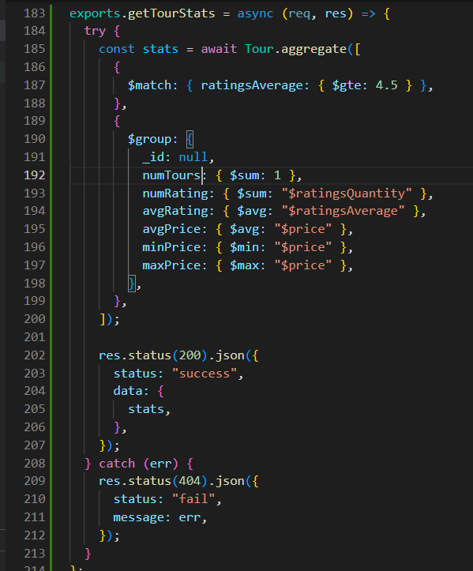
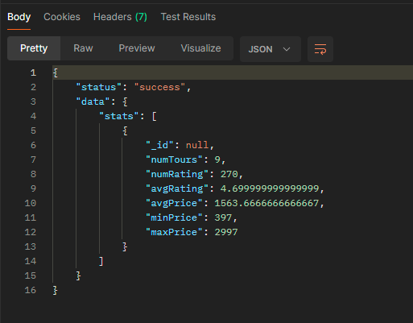

// powershall  
// Get-ExecutionPolicy  
// Set-ExecutionPolicy RemoteSigned

// after work  
// Set-ExecutionPolicy Restricted

// 200- ok  
// 201- created  
// 404- Not Found  
// 204- no content  
// 500 - internal server error  
// 400 - bad request

### basic branch

in the basic branch how api works with defferent different http status code.

### v2 branch

in the v2 branch use `route` to refactor code

### v3 branch

creating and mounting multiple routers (use middleware for tour and user path)

### v4 branch

refactoring code by dividing file (routes,controllers)  
learned how exports and module.exports work and then  
learned custom middleware by checking id and last  
learned enviroment variable

```
const dotenv = require("dotenv");
dotenv.config({ path: "./config.env" });
const app = require("./app");

// console.log(app.get("env"));
// development
// console.log(process.env);

const port = process.env.PORT;
app.listen(port, () => {
  console.log(`app running on port ${port}...`);
});

// environment variable
// npm i dotenv
// NODE_ENV=development nodemon server.js or create(extension=Dotenv) config.env file
```

### v5 branch

connecting mongodb(Atlas) to our project  
modilfying config.exe file  
installing npm i mongoose  
making schema and model  
insert first data to database

### v6 branch

Learned MVC architechture  
CRUD operation  
created filtering, some advance filtering, sorting, limiting fields, pagination  
video-99

  
  
  
  
  


### v7 branch

Alias ( top 5 tours) by using middleware
video-100


### v8 branch

refactoring code ( created new class apiFeatures and also separate them in new file )
learned how aggregate pipeline work.  
solved one problem ( find busyest month of tours in the perticular year )

video-

  

